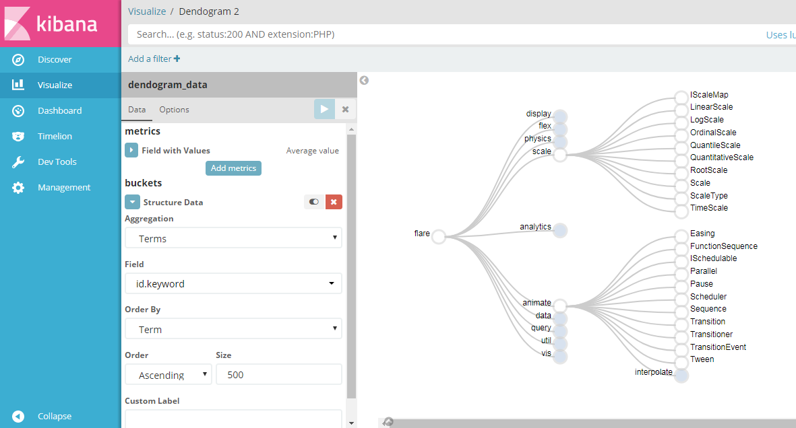

# Kibana Dendrogram Visualization to show ... dendrograms :) - Plugin

This is a new custom visualization (for Kibana version 4.5.1) that allows
displaying a dendrogram chart to show and index or classes, or some other hierarchical
structure.

If you really liked this and feel like making a donation : <a href="https://www.paypal.com/cgi-bin/webscr?cmd=_donations&business=juan.carniglia@gmail.com&lc=AR&item_name=JuanCarniglia&item_number=1009&currency_code=USD&bn=PP-DonationsBF:btn_donate_LG.gif:NonHosted">

</a>

If you need a modified version, or one that works on a previous (or future) Kibana release,
please let me know.

Example of how it looks:



## Installation Steps

You can just copy the dendrogram_vis folder into KIBANA_HOME/src/plugins)
and run kibana (with --dev parameter).

You will have to re-bundle, if you just start the service or run in non-dev mode.

## How does it work

In order to work this plugins needs a simple Schema configuration:

- One Metric Parameter (whatever, really optional)
- One aggregation (bucket) to take the structure from.

(See flare.csv as an example)

In this project there is a folder (dendrogram_data) with a script in python to get a CSV
into the elasticsearch server.

(The python script requires elasticsearch and csv packages).

The index on the elasticsearch should have a field called "id", that contains (for instance):

parent

parent.child1

parent.child2

parent.child1.child1

...

and so on.

## Notes on D3

To make it work you have to have the latest D3 distribution (Which up to today is #4).

The problem is that Kibana 5.5 comes with version 3, so you have to:

(whils on the dendrogram_vis folder)
```
npm install d3 d3-tree
```

You MAY encounter an issue with xmlhttprequest (not finding a module called child_process), which I have fixed by adding:

```
"browser" : {
	"child_process" : false
  }
```
To the xmlhttprequest package.json file (that got installed by npm on the node_modules folder). 

As long as you don't actually USE xmlhttprequest, from the visualization, it should be ok.  

## Future changes

- Add filtering from the nodes (clicking a node adds/remove filters)
- Zooming and Panning
- Colors (or icons) change based on data
